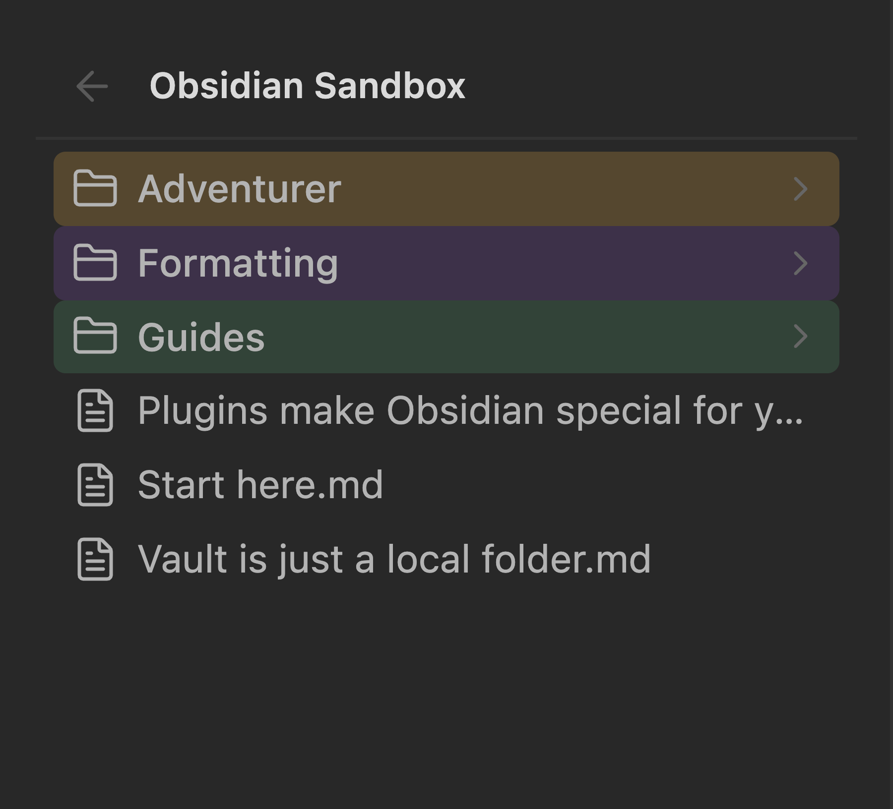
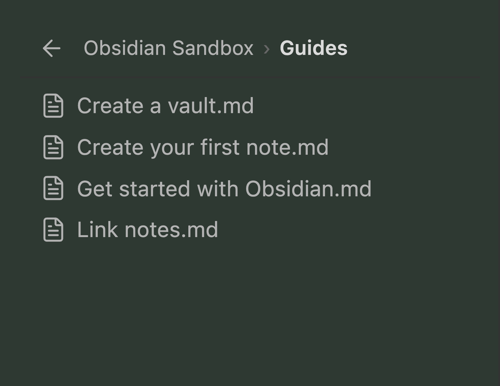

# Folder Nav

**English** · [简体中文](README.zh.md)

An Obsidian plugin that replaces the sidebar file tree with **drill-down navigation** — the sidebar shows one folder at a time, and a breadcrumb walks you back up. Like double-clicking into folders in Windows Explorer or macOS Finder.

No more ever-deepening indentation eating the width of a narrow sidebar.

<p align="center">
  
  
</p>

## Why

Obsidian's file explorer indents every level. By the third or fourth level — `Notes › Course › Week 3 › Handout.pdf` — the names are squeezed into a sliver, and the whole tree is always on screen competing for attention.

Folder Nav keeps the sidebar at a constant depth. You see the folder you're standing in, and the breadcrumb tells you where that is.

## Usage

Enabled by default: it takes over the built-in **Files** view. The sidebar tab is unchanged, and so is the ribbon icon.

**Mouse**

| Action | Result |
| --- | --- |
| Click a folder | Go into it |
| Click a file | Open it in the main editor area (never in the sidebar) |
| Click a breadcrumb segment | Jump back to that level |
| Click `←` | Go up one level |
| Right-click a file or folder | The native Obsidian context menu |

**Keyboard** (click the list first)

| Key | Action |
| --- | --- |
| `↑` / `↓` | Move the selection |
| `Enter` | Open the selection |
| `Backspace` / `Alt+←` / `Cmd/Ctrl+[` | Go up one level |
| `Esc` | Clear the selection |

**Commands** (also bindable in Settings → Hotkeys)

- `Folder Nav: Toggle drill-down / native file list`
- `Folder Nav: Go to vault root`
- `Folder Nav: Go up one level`
- `Folder Nav: Reveal current file in list`

## Settings

| Setting | Description |
| --- | --- |
| **Take over the file list** | Turn off to restore the native tree instantly — nothing is left behind. |
| **Sort order** | *Follow native* mirrors the sort the built-in explorer was using when Folder Nav took over (alphabetical, modified time, …). *Folders first* always puts folders above files, then sorts by name. |
| **Reveal current file** | Follow the active note into its folder. Seeded from Obsidian's own "Auto reveal" setting. |
| **Show file extensions** | Off shows `Note` instead of `Note.md`. |
| **Hide loose files in the vault root** | Only affects the vault root — handy when attachments pile up there. |
| **Hidden extensions** | Comma-separated list used by the setting above. |

## How it works

Folder Nav replaces the *view* inside the existing file-explorer leaf rather than disabling Obsidian's core file-explorer plugin. Disabling that plugin would also remove the sidebar's ribbon icon and break `revealInFolder`, which Obsidian's own "Reveal file in navigation" command and other plugins call into.

The replacement is re-applied on `layout-change`, so the built-in plugin recreating its leaf (on layout restore, or when you run "Open file explorer") doesn't leave you with a native tree. Duplicate drill-down leaves are collapsed down to one.

Nothing in your vault configuration is rewritten. `workspace.json` and `core-plugins.json` are never modified by the plugin.

## Limitations

- **No drag-and-drop to move files.** Obsidian's native drag handling is bound to its own explorer internals; reusing it is fragile across versions. Use the context menu's "Move file to…" instead.
- **No inline rename (F2) or multi-select.** Same reason — use the context menu.
- **Custom folder order isn't reproduced.** Sorting is computed from your chosen order rather than borrowed from the built-in explorer, which is destroyed on takeover. Folders you manually reordered with another plugin will sort by name or date instead.
- **Uses undocumented APIs.** Taking over the file list relies on `app.internalPlugins`, which Obsidian doesn't guarantee. A major app update may require fixes. The failure mode is designed to be safe: if the takeover can't run, you get the native file list back.
- **Desktop and mobile.** `isDesktopOnly` is off, but the drill-down layout has mainly been exercised on desktop.

## Development

```bash
npm install
npm run build     # typecheck + bundle
npm run dev       # watch mode
```

`main.js` is written to the project root. To also copy it into a vault while developing:

```bash
OBSIDIAN_PLUGIN_DIR=~/MyVault/.obsidian/plugins/folder-nav npm run build
```

Debug loop, if you have the Obsidian CLI:

```bash
obsidian vault=MyVault plugin:reload id=folder-nav
obsidian vault=MyVault dev:errors
obsidian vault=MyVault dev:screenshot path=/tmp/shot.png
```

### Source layout

```
src/
├── main.ts       Plugin entry: lifecycle, commands, settings wiring
├── view.ts       FolderNavView — navigation state, history, list rendering
├── takeover.ts   Swap the built-in explorer's view for ours, and back
├── breadcrumb.ts Breadcrumb trail construction
├── render.ts     A single list row
├── sort.ts       Sorting and the vault-root filter
└── settings.ts   Settings tab
```

## License

MIT
